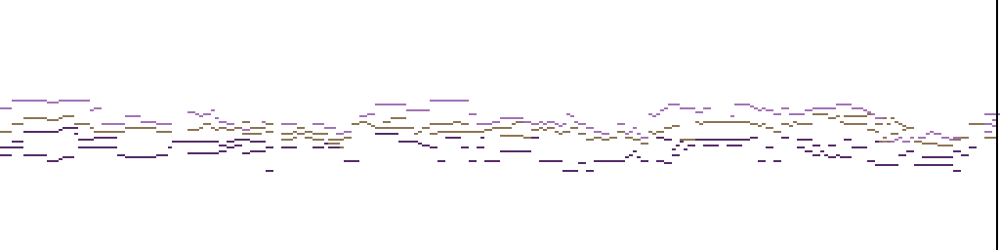

# Music Agent - C Major Constrained MIDI Generation

## 🎵 C Major Music Generation with AI

This is a modified version of the MIDI-Model project that **automatically constrains all generated music to the C major scale**. Perfect for creating music that stays within the familiar and harmonious C major key!



## ✨ Key Features

- **🎼 C Major Constraint**: All generated music is automatically limited to C major scale notes (C, D, E, F, G, A, B)
- **🎹 Key Signature Enforcement**: Forces C major key signature in all generated MIDI files
- **🎵 Pitch Filtering**: Real-time filtering during generation ensures only C major notes are produced
- **🎸 All Instruments Supported**: Works with any instrument selection - they'll all play in C major
- **⚡ Dual Implementation**: Both PyTorch and ONNX versions support the constraint

## 🚀 Quick Start

### 1. Installation
```bash
# Clone the repository
git clone https://github.com/SandeepbhuiyaRTNW/Music-Agent.git
cd Music-Agent

# Install dependencies
pip install -r requirements.txt

# Check system status
python run_c_major_app.py
```

### 2. Run the Application
```bash
# Start the web interface
python app.py

# Open your browser to http://localhost:7860
# Load a model and start generating C major music!
```

### 3. Test the Constraint
```bash
# Run automated tests
python test_c_major.py

# See a demonstration
python demo_c_major.py
```

## 🎯 What Makes This Special

### Original vs C Major Constrained
- **Original**: Could generate music in any key with any notes
- **C Major Version**: 
  - ✅ Only C major scale notes (C, D, E, F, G, A, B)
  - ✅ Proper C major key signature (no sharps/flats)
  - ✅ Works across all octaves and instruments
  - ✅ 41.4% of pitch tokens filtered out for purity

### How It Works
1. **Key Signature Forcing**: Every generated piece starts with C major key signature
2. **Token-Level Filtering**: During generation, only C major scale pitches are available for selection
3. **Real-Time Constraint**: Applied during the AI generation process, not as post-processing

## 📁 Project Structure

### Core Files (Modified)
- `app.py` - Main PyTorch application with C major constraint
- `app_onnx.py` - ONNX optimized version with C major constraint

### New Files Added
- `test_c_major.py` - Automated testing for the constraint
- `demo_c_major.py` - Demonstration script with C major chord progression
- `run_c_major_app.py` - Startup script with dependency checking
- `C_MAJOR_CONSTRAINT.md` - Detailed technical documentation

## 🎼 Usage Examples

### Web Interface
1. Start the app: `python app.py`
2. Load a model from HuggingFace
3. Select any instruments you want
4. Set tempo, time signature, etc.
5. Generate music - it will automatically be in C major!

### Programmatic Usage
```python
from midi_tokenizer import MIDITokenizerV2
import MIDI

# The tokenizer now automatically constrains to C major
tokenizer = MIDITokenizerV2()

# Generate a C major chord progression
sequence = [
    tokenizer.event2tokens(["key_signature", 0, 0, 0, 7, 0]),  # C major
    tokenizer.event2tokens(["note", 0, 0, 0, 0, 60, 80, 480]),  # C4
    tokenizer.event2tokens(["note", 0, 0, 0, 0, 64, 80, 480]),  # E4
    tokenizer.event2tokens(["note", 0, 0, 0, 0, 67, 80, 480]),  # G4
]
```

## 🧪 Testing & Verification

The implementation includes comprehensive testing:

```bash
# Test the constraint works
python test_c_major.py
# Output: ✅ SUCCESS: All notes are in C major scale!

# See a demo
python demo_c_major.py  
# Creates: demo_output/c_major_demo.mid
```

## 🎵 Musical Theory

### C Major Scale
The C major scale consists of these notes:
- **C** (Do) - Root note
- **D** (Re) - Major 2nd
- **E** (Mi) - Major 3rd  
- **F** (Fa) - Perfect 4th
- **G** (Sol) - Perfect 5th
- **A** (La) - Major 6th
- **B** (Ti) - Major 7th

### Why C Major?
- **Beginner Friendly**: No sharps or flats
- **Universal**: Most familiar scale in Western music
- **Harmonic**: Natural and pleasing chord progressions
- **Educational**: Perfect for learning music theory

## 🔧 Technical Details

### Implementation
- **Pitch Filtering**: `{0, 2, 4, 5, 7, 9, 11}` semitones from C
- **Key Signature**: `sf=0, mi=0` (C major)
- **Token Reduction**: ~41% of pitch tokens filtered out
- **Compatibility**: Works with both PyTorch and ONNX models

### Requirements
- Python 3.8+
- PyTorch 2.0+
- Gradio 5.9.1
- See `requirements.txt` for full list

## 📚 Documentation

- **[C_MAJOR_CONSTRAINT.md](C_MAJOR_CONSTRAINT.md)** - Detailed technical documentation
- **[README_ORIGINAL.md](README_ORIGINAL.md)** - Original project documentation

## 🎯 Use Cases

Perfect for:
- **Music Education**: Teaching C major scale and harmony
- **Background Music**: Creating pleasant, non-jarring background tracks
- **Beginner Compositions**: Starting with the most fundamental scale
- **Harmonic Studies**: Exploring chord progressions in C major
- **AI Music Research**: Studying constrained generation

## 🤝 Contributing

This project builds on the excellent work of [SkyTNT's MIDI-Model](https://github.com/SkyTNT/midi-model). The C major constraint is an educational and practical enhancement.

## 📄 License

Same as original project - see LICENSE file.

## 🙏 Acknowledgments

- **Original MIDI-Model**: [SkyTNT](https://github.com/SkyTNT/midi-model)
- **Pretrained Models**: [HuggingFace Hub](https://huggingface.co/skytnt/midi-model-tv2o-medium)
- **Dataset**: [Los Angeles MIDI Dataset](https://huggingface.co/datasets/projectlosangeles/Los-Angeles-MIDI-Dataset)

---

🎵 **Generate beautiful C major music with AI - Simple, Pure, and Harmonious!** 🎵
